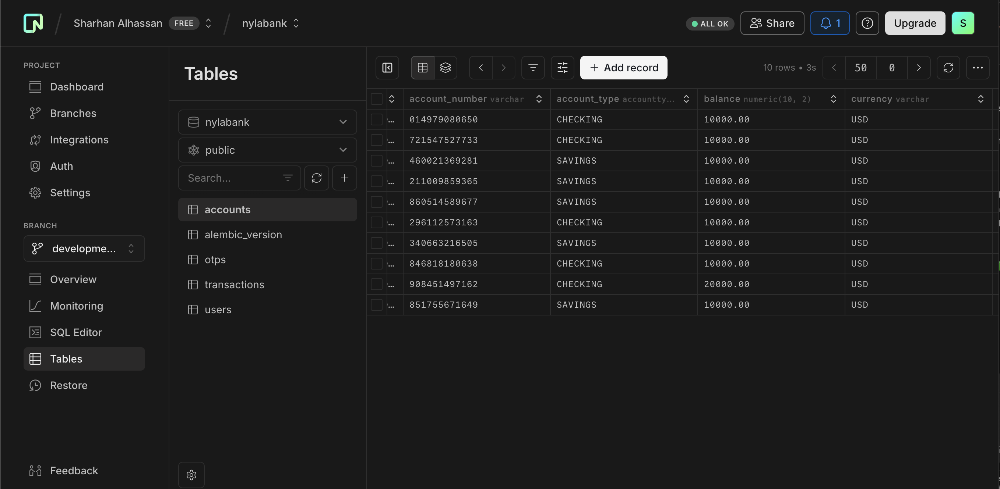
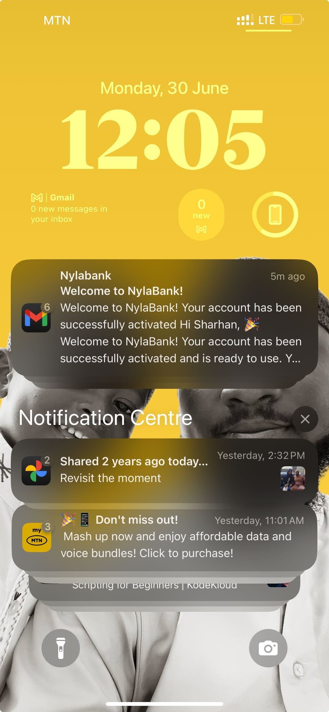

# NylaBank API

A modern, secure banking API for user accounts, transactions, and admin operations.

---

## 🚀 CI/CD

- Automated with GitHub Actions and Kubernetes (see `k8s_deploy/`)
- Push to `main` triggers build, test, and deploy

## 📚 API Documentation

- Interactive docs: `/docs` (Swagger UI)
- Redoc: `/redoc`
- Versioned: `/api/v1/`

## 👤 User Creation Flow

1. Register with email & password
2. Receive verification email
3. Verify code to activate account
4. Login and create bank accounts


## 💳 Accounts & Transactions

- **Accounts**: Create, list, delete, get statements
- **Transactions**: Deposit, withdraw, transfer, view history



### Transaction Demo

- Deposit/Withdraw: Instant balance update
- Transfer: Between user accounts


## 🏗️ Architecture

- FastAPI backend
- PostgreSQL (async)
- Alembic migrations
- Modular routers: users, accounts, transactions, admin
- Email notifications (Jinja2 templates)



## 🗄️ Database Schemas

- Users, Accounts, Transactions, OTPs
- Enum types for roles, account types, transaction types


---

## 🛠️ Local Development

```sh
# Migrate DB
alembic upgrade head
# Start server
uvicorn main:app --reload --port 8000
```

---

## 📬 Contact & Support

- Email: support@nylabank.com

---

> See code for more details. Contributions welcome!
